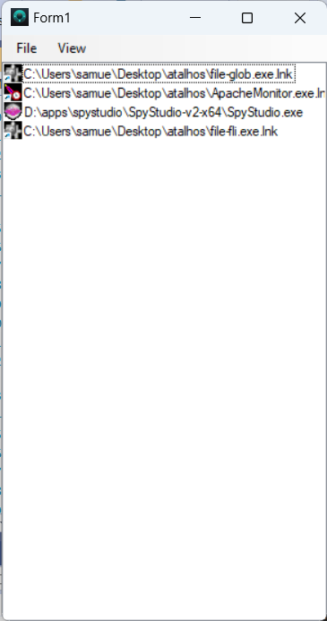

This a implementation of AppMenuLauncher in Windows Forms using C#.
It was created to be a demonstration and for learning purposes of what Windows Forms can do in terms of GUI interfaces for Windows.

The implementation was described in the post article [Selecting the best GUI toolkit - part 4: Windows Forms](https://codehouse.digfish.org/selecting-the-best-gui-toolkit-part-4-windows-forms/). This one is the foirth of a series introduced in  [Selecting the best GUI programming toolkit – First part (planning)](https://codehouse.digfish.org/selecting-the-best-widget-toolkit-1/).

## Running

Clone locally the project, and on Visual Studio 2019 standard version open the [solution file](AppMenuSharper.csproj) and hit "Start >" to run the project.
If you just want to run the app, without building it, use the zip in the Releases section.

